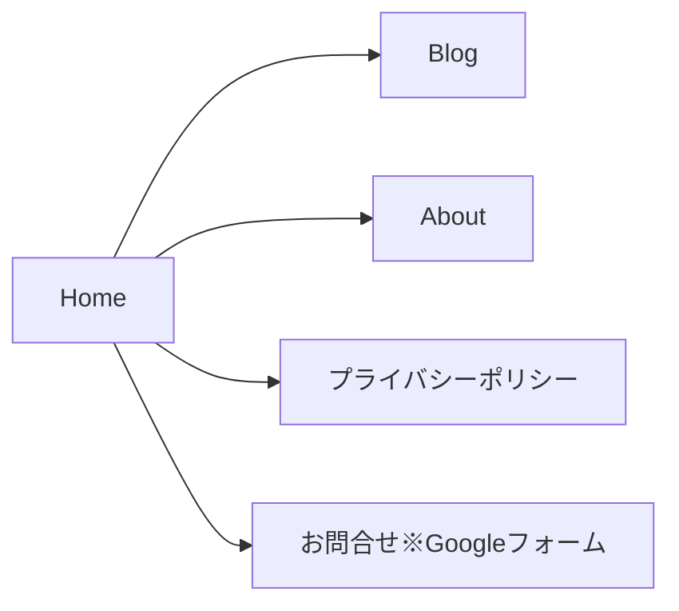
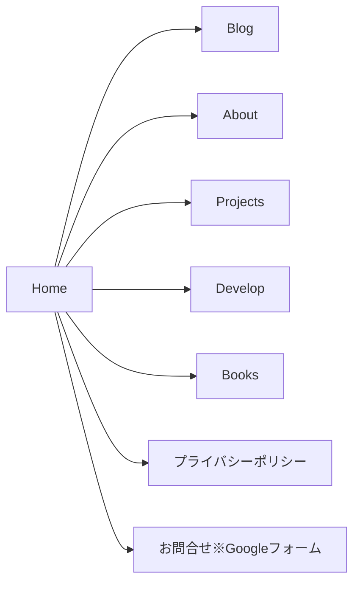

# 開発環境

## コードフォーマット関連

pre-commitでチェック

* Prettier
* ESlint
* cSpell
* Vitest
* svelte-check

# リニューアルの目的

課題解決のためという旗は掲げておくが、実情は新しい技術を試したいというお気持ちのリニューアル

## 現状の課題

- どのようなスキルを持っているのかわからない
  - どんな働き方をしていたのかも知れるといい
- 経験を知るには長い文章を読まなければならない（読まない）
- 経験した技術スタックが増えているがアップデートされていない
- ホワイト基調で目に優しくないデザイン

## 課題解決の方針

- プロジェクツページを新設する
  - ページ内で制作したものを（掲載できる範囲で）紹介する
  - 関わってた案件に対して、技術スタック、開発環境、経験年数などを記載（React、jQuery、チーム開発とか）
  - 一般的なスキルも記述する（チーム開発とかGitとか）
- アバウトページを刷新する
  - 文章による表現を止める
  - 何が得意かをわかるように記述しておく（細部にまでこだわるとか、すべての媒体で美しく見せるとか、パフォーマンスにこだわるなど）
- グラフィック付きで表現する
  - SVGアイコン
- スクロールしてみたくなるような仕組みを実装する
  - スナップスクロール
  - アニメーション
- ダークテーマに対応させる

# ペルソナ

## パターン1

氏名：森島　順一
年齢、性別：39歳、男性
家族構成：既婚で双子（息子たち）の子供がいる4人世帯
収入レベル：700万円
職業：エンジニア（テックリード）
ライフスタイル：平日は週2日は出社し、残りの3日はリモートワークで働いている。休日は家族で過ごす時間を大事にしている。
価値観：仕事は楽しんでこそ品質の高い成果物が生み出せると考えている。職人気質で細部のこだわりが気になる。

ストーリー：
自信がPJMを務めるプロジェクトで人員補充の要望が出ており、新しいメンバー候補を探している。プレイングマネージャーとして自分も手を動かす働き方をしているため、じっくり履歴書を読んでいる時間がなく採用候補の探し方に苦労している。技術面の知識が豊富なだけでなく、経験豊富でエンジニア以外とも円滑に仕事を進められる人材を採用したいと考えている。

## パターン2

職種：エンジニア

# 遷移要件

## 既存の遷移要件

## リニューアル後の遷移要件

# 機能要件

## 共通

### グローバルヘッダー

ハンバーガーメニューの中に入れる

- Home（リンク）
- About（リンク）
- Develop（リンク）
- Projects（リンク）
- Books（リンク）
- Blog（外部リンク）

### フッター

- コピーライト

## Home

- Develop
  - 現行のDevelopと同じようなもの
  - 個人的に開発しているものがわかる
  - 最新の3件くらい
- Projects
  - 最新の1件の簡易表示
- Books
  - お気に入りの上位3件くらい
- About
  - 現行のAuthorと同じようなのもの
  - GitHubのリンクなどがわかる
- プライバシーポリシー
  - 定型文貼り付け

## About

## コンテンツ

- 年表形式で経験してきたことを記述する
- CSS結構できること、細かいポイントに気を配れることがわかるように
  - CSSでの表現を頑張る

## デザイン

- 上下に流れる年表
- 一番上が現在で下に向かうにつれて過去に向かう
- シャープなデザインがよい

参考：[https://blog.universe-web.jp/1680/](https://blog.universe-web.jp/1680/)

## Develop

## コンテンツ

個人的に開発してる簡単なアプリをリスト形式で羅列していく

## デザイン

- 簡易版は現行バージョン踏襲でいいかも
- Developページには詳細バージョンのリストを作る
- もうちょっと情報量増やす
  - 苦労したポイントとか
  - なぜ作ろうとしたとか
  - 改善したい箇所とか

## Projects

### コンテンツ

- 過去に携わったプロジェクトを書いていきたい
- 経験してきたものを見てスキルを読み取れるように

### デザイン

参考: [https://johnkavanagh.co.uk/projects/](https://johnkavanagh.co.uk/projects/)

## Books

### コンテンツ

- 書籍を載せるページ
  - どんな人どの場面で勧められるか（新社会人・シニアエンジニアなど）
  - こういうものを読んでいることで人柄がわかるようなもの
  - 本の画像とリンクはISBNで管理したい（Google Books API）
  - できればSSGしておきたい

### デザイン

- 本棚みたいな感じ
  - 一段目は長いスクロールで新社会人向け
  - 駆け出しエンジニア向け
  - 深掘りする人向けなど

参考：[https://techbookfest.org/](https://techbookfest.org/)

## プライバシーポリシー

現行のものと同じ文章を記載する