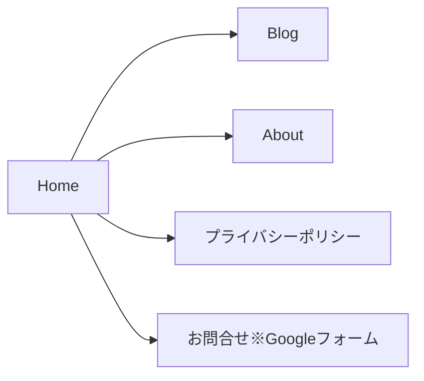
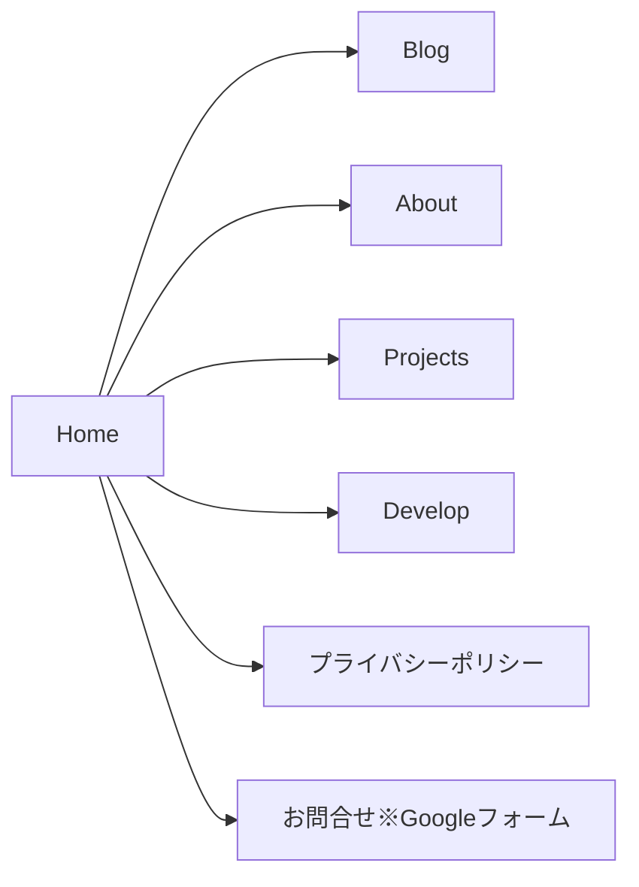

# リニューアルの目的

課題解決のためという旗は掲げておくが、実情は新しい技術を試したいというお気持ちのリニューアル

## 現状の課題

- どのようなスキルを持っているのかわからない
  - どんな働き方をしていたのかも知れるといい
- 経験を知るには長い文章を読まなければならない（読まない）
- 経験した技術スタックが増えているがアップデートされていない
- ホワイト基調で目に優しくないデザイン

## 課題解決の方針

- プロジェクツページを新設する
  - ページ内で制作したものを（掲載できる範囲で）紹介する
  - 関わってた案件に対して、技術スタック、開発環境、経験年数などを記載（React、jQuery、チーム開発とか）
  - 一般的なスキルも記述する（チーム開発とかGitとか）
- アバウトページを刷新する
  - 文章による表現を止める
  - 何が得意かをわかるように記述しておく（細部にまでこだわるとか、すべての媒体で美しく見せるとか、パフォーマンスにこだわるなど）
- グラフィック付きで表現する
  - SVGアイコン
- スクロールしてみたくなるような仕組みを実装する
  - スナップスクロール
  - アニメーション
- ダークテーマに対応させる

# 遷移要件

## 既存の遷移要件

## リニューアル後の遷移要件

# 機能要件

## 共通

### グローバルヘッダー

ハンバーガーメニューの中に入れる

- Home（リンク）
- About（リンク）
- Develop（リンク）
- Projects（リンク）
- Blog（外部リンク）

### フッター

- コピーライト

## Home

- Develop
  - 現行のDevelopと同じようなもの
  - 個人的に開発しているものがわかる
  - 最新の3件くらい
- Projects
  - 【要検討】最新の1件の簡易表示？
- About
  - 現行のAuthorと同じようなのもの
  - GitHubのリンクなどがわかる
- プライバシーポリシー
  - 定型文貼り付け

## About

【要検討】

## Develop

【要検討】

## Projects

【要検討】

## プライバシーポリシー

現行のものと同じ文章を記載する